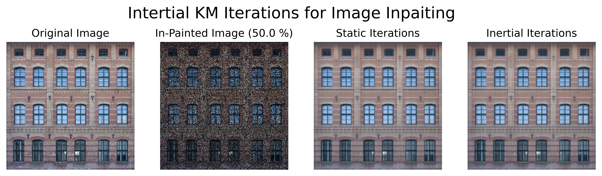

# Image Inpainting using Inertial Krasnoselskii-Mann Iterations

The aim of this project is to inpaint an image according to the model originally proposed by D. Davis and W. Yin, using a method relying on accelerated Krasnoselskii-Mann Iterations, developped by I. Fierro, J. J. Maulén and J. Peypouquet. 
    

    
